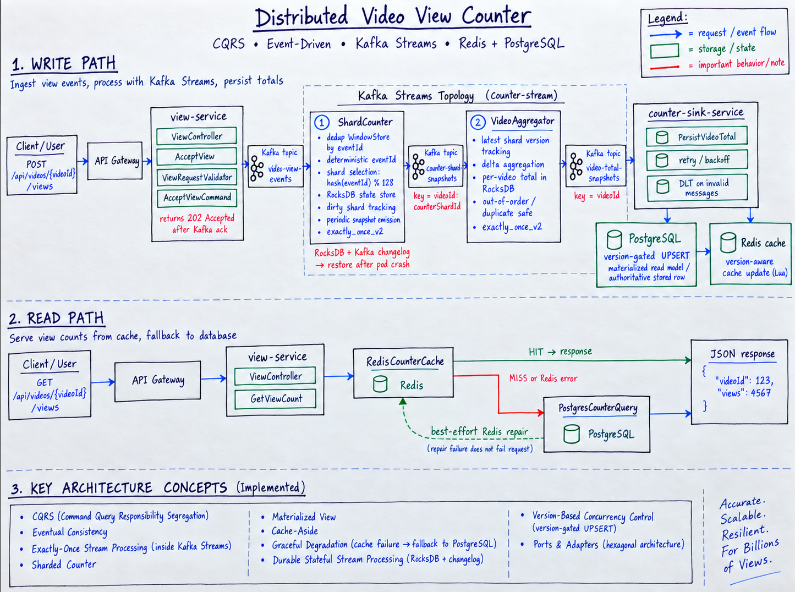
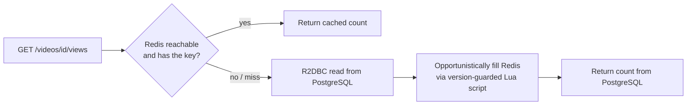

# Distributed Video View Counter

A backend system for counting video views under a massive, sudden spike of traffic, while
maintaining high practical accuracy, avoiding a database write per view, and preventing duplicate
retries within the configured deduplication window.

## Table of Contents

1. [Problem Statement](#1-problem-statement)
2. [Architecture](#2-architecture)
3. [Data Model](#3-data-model)
4. [Why This Design](#4-why-this-design)
5. [API Endpoints](#5-api-endpoints)
6. [Running Locally](#6-running-locally)
7. [Possible Future Improvements](#7-possible-future-improvements)

---

## 1. Problem Statement

Suppose we have a simple counter:

```text
video_id = 123
views = 0
```

Now imagine that, at the same time **1,000,000 users** open the video.

Design a **Distributed Counter** that can handle this scale while considering the following requirements:

* The view count should be as accurate as possible.
* The database should not be overwhelmed by 1,000,000 concurrent updates.
* Duplicate events should not increase the count incorrectly.
* Late or out-of-order events should be handled safely.
* If strong consistency conflicts with performance, the trade-off should be explicit.

---

## 2. Architecture



The main idea is simple: **Kafka absorbs the burst, Kafka Streams keeps a durable count outside
the database, and PostgreSQL/Redis are read models rebuilt from periodic, idempotent snapshots
— never written to per view.** The system never trusts an in-memory counter alone for
correctness; the count that survives a crash is always the one written to RocksDB's Kafka
changelog, not the one sitting in a Pod's heap.

### 2.1 Normal path (accepting one view)

A request first reaches the API Gateway, which handles the initial routing and forwards the request to the appropriate backend service.

The request then goes to the view-service. This service is built with Spring WebFlux and handles the incoming view request. Instead of updating a database directly, it creates a view event and publishes it to Kafka.

The counter-stream-service consumes those events from Kafka. It uses Kafka Streams to remove duplicate events, count views across multiple shards, and aggregate them into the total view count for each video. The aggregated result is then published to another Kafka topic.

The counter-sink-service listens to that final topic. It receives the latest video totals and stores them in both PostgreSQL and Redis.

PostgreSQL keeps the durable version of the counter, while Redis is used for fast reads when clients request the current number of views.

1. **Deterministic event identity.** `view-service` computes an HMAC-SHA256 `eventId` from a
   namespaced input containing the email, video ID, and `Idempotency-Key`. The same retry, from
   the same user, for the same video, with the same `Idempotency-Key`, always produces the exact
   same `eventId`. This is what stops a user's retried click from being counted twice, later in
   the pipeline.
2. **Shard selection.** `counterShardId = stableHash(eventId) % 128`. Using the raw `videoId` as
   the Kafka key would put every view of one viral video on a single partition. Keying by
   `videoId:shard` instead spreads a hot video's traffic across up to 128 shards, while still
   guaranteeing that a retried event always lands on the exact same partition as its first
   attempt (needed for deduplication further down).
3. **Publish and acknowledge.** The event is published with `acks=all` and an idempotent
   producer. The HTTP call only returns `202 Accepted` once Kafka has actually acknowledged the
   write — nothing is written to any database at this point at all.
4. **Stage 1: deduplicate and count.** A Kafka Streams processor checks a persistent
   `WindowStore` (seven-day retention, keyed by `eventId`, indexed by processing time). If the
   `eventId` was already seen, the event is dropped. Otherwise the shard's absolute counter is
   incremented by exactly one and marked dirty.
5. **Periodic snapshot emission.** Every second, a punctuation callback visits only the *dirty*
   shards (not a full scan) and emits an absolute `count`/`version` pair to
   `counter-shard-snapshots`. Out of up to a million raw events, this produces at most ~128
   shard snapshots per interval, per active video — not a million database writes.
6. **Stage 2: aggregate shards into a video total.** A second Streams processor keeps the last
   accepted version per shard and a running total. It applies each shard's *delta*
   (`newCount - previousCount`), so replaying an already-applied snapshot changes nothing.
7. **Idempotent materialization.** A JDBC sink reads dirty video totals and performs a
   version-gated `UPSERT` into PostgreSQL, then atomically updates Redis with a Lua script that
   also checks the version. Neither store ever adds a delta — they always write the latest
   known absolute total, and only if it is actually newer.

### 2.2 Periodic snapshotting (the real safety net)

The one-second punctuation in step 5 above is not just an optimization — it is the mechanism
that actually gets counts out of memory and into something durable and shareable. Each
punctuation drains a bounded batch (10,000 dirty keys by default) so one extremely popular video
can't monopolize a Streams task forever; any leftover dirty keys are simply picked up on the
next tick. Deleting a dirty marker and emitting its snapshot happen inside the same Kafka
Streams transaction (`exactly_once_v2`), so a crash mid-punctuation cannot silently lose or
duplicate a shard's contribution — recovery replays from the changelog and produces the same
result.

### 2.3 Surviving a Pod crash

No Streams task keeps its state only in memory. Every count lives in a local RocksDB store that
is continuously mirrored to a Kafka changelog topic. So if a Streams Pod crashes:

- If it crashed before a transaction committed, that work never happened from Kafka's point of
  view — it will be reprocessed from the last committed offset.
- If it crashed after committing, the state and the output are already durable. Kubernetes
  restarts the Pod (or another instance picks up the task), Kafka Streams restores RocksDB from
  the changelog, and processing resumes.

A count is never lost or double-applied "because a Pod happened to die," because its fate is
always written to a changelog, not held only in one process's memory.

### 2.4 What happens if Redis goes down

This is the most important failure case for the **read path**, so it gets its own section.

**Simple idea (not used):** if Redis is unreachable, just fail the `GET` request. The problem:
Redis is a cache, not the source of truth — failing reads because a cache is down would make the
whole read path only as available as Redis, for no good reason.

**What we do instead:**



1. A `GET` always tries reactive Redis first.
2. On a cache miss or Redis error, it falls back to R2DBC PostgreSQL — the authoritative row.
3. After a successful database read, the result opportunistically fills Redis back in, using the
   same version-guarded Lua script the sink uses. If that fill fails, the already-successful
   database read is still returned to the caller; a failed cache fill never fails the request.

PostgreSQL is always allowed to answer, and the version check means a slow or resurrected Redis
instance can never overwrite a newer value with an older one during cache repair. Only latency
changes on the fallback path. The same reasoning covers PostgreSQL being unavailable: ingestion
keeps flowing through Kafka regardless, cached reads keep working, and the JDBC sink retries with
exponential backoff (500 ms up to 30 s) without advancing past the failed work.

### 2.5 Handling duplicate events

Duplicates can happen for three different reasons, and this design handles all three:

- **A user retries the same click.** Caught at the source — the client-supplied
  `Idempotency-Key` makes the `eventId` identical, so Kafka Streams' `WindowStore` recognizes it
  as already-seen and drops it (see [2.1](#21-normal-path-accepting-one-view), step 4).
- **Kafka redelivers a shard or total snapshot.** Kafka Streams uses `exactly_once_v2` to
  transactionally coordinate consumed offsets, state-store updates, and records produced inside
  the Streams topology. External systems such as PostgreSQL and Redis are outside that Kafka
  transaction, so the sink is still designed to tolerate redelivery through version-gated
  idempotent writes. Stage 2 ignores any shard snapshot whose `version` is not strictly greater
  than the last one it recorded; the sink's `UPSERT` and Lua script both ignore any total snapshot
  whose `version` is not strictly greater than what is already stored.
- **A crash forces reprocessing.** `exactly_once_v2` inside Kafka Streams means a replayed input
  after a crash reproduces the exact same output — not a second copy of it.

This makes processing an event, a shard snapshot, or a total snapshot twice have the *exact same
effect* as processing it once — the property called **idempotency**. It holds at every hop of
the pipeline, not just at the very first one.

### 2.6 Clean architecture layering

The project follows a Ports & Adapters-inspired structure, keeping domain logic and application
policies separated from external infrastructure where practical:

- **`domain`** — plain identity/sharding logic (`EventIdentity`, `CounterShardSelector`). No
  Spring, no Kafka, no Redis.
- **`application`** — use cases (`AcceptView`, `GetViewCount`, `PersistVideoTotal`), request
  validation, and small ports for publishing, cache access, and durable reads/writes.
- **`adapter.in` / `adapter.out`** — the real implementations: the REST controller, the Reactor
  Kafka publisher, the Kafka Streams processors, the PostgreSQL/Redis stores. This is where
  framework-specific code lives.
- **`config`** — wiring: topology construction, producer/consumer settings, retry policy.

The benefit: storage and cache details are behind narrow ports where that boundary is useful,
while Kafka Streams processors remain Kafka-specific adapters because they directly extend Streams
framework classes.

### 2.7 Architecture Patterns & Design Decisions

The steps above are built out of well-known patterns. Naming them here is meant to make the
design easier to recognize and discuss, not to check a buzzword box — each one is doing real
work at a specific stage.

| Pattern | Where it appears | Why it's used here |
|---|---|---|
| **CQRS** (Command Query Responsibility Segregation) | The write side (`POST` → Kafka → Streams → sink) and the read side (`GET` → Redis/PostgreSQL) are completely separate code paths and data stores. A `POST` never queries a database for its answer; a `GET` never touches Kafka. | Lets the write path be optimized purely for absorbing a burst, and the read path be optimized purely for low-latency lookups, without either one compromising the other. |
| **Event-Driven Architecture / Event Streaming** | Every stage talks to the next only through a Kafka topic (`video-view-events` → `counter-shard-snapshots` → `video-total-snapshots`). | Decouples ingestion, counting, and materialization so each can fail, restart, or scale independently. |
| **Eventual Consistency** | `POST /views` can return `202 Accepted` before the updated total is visible through `GET`. | The system intentionally favors burst absorption and scalable writes over immediate global read-after-write consistency. |
| **Exactly-Once Stream Processing** | Kafka Streams is configured with `exactly_once_v2` for the topology's consumed offsets, state stores, and produced records. | Prevents committed stream processing work from being partially applied inside Kafka Streams, without claiming a global transaction with PostgreSQL or Redis. |
| **Idempotent Consumer / Idempotent Receiver** | Dedup `WindowStore` keyed by `eventId` (2.1, step 4); version-gated `UPSERT` in PostgreSQL and version-gated Lua script in Redis (2.5). | Makes redelivery — from a client retry, stream replay, or sink redelivery — a safe no-op instead of a double-count. |
| **Sharding** (hash-based key partitioning) | `counterShardId = stableHash(eventId) % 128`, folded into the Kafka key `videoId:shard` (2.1, step 2). | Spreads one viral video's traffic across many partitions instead of pinning it to one. |
| **Materialized View** | The `video_counter` table and the `video:{id}:views` Redis hash. | Both are read-optimized projections rebuilt from the stream of snapshots — neither one is the source of truth by itself. |
| **Cache-Aside** (a.k.a. Lazy Loading) | `GET` reads Redis first, falls back to R2DBC PostgreSQL on a miss, and opportunistically fills Redis afterward (2.4). | The classic read-through-cache-with-fallback shape, with an explicit, version-safe fill step. |
| **Snapshot pattern** (periodic, not per-event) | The one-second punctuation that emits only *dirty* shard/video state (2.2), instead of a message per view. | Trades a small, bounded latency window for a large reduction in write volume downstream. |
| **Version-Based Optimistic Concurrency / Monotonic Versioning** | PostgreSQL and Redis accept only snapshots with a strictly newer version. | Protects the read models from duplicate, late, or out-of-order snapshots. |
| **Graceful Degradation / Fallback** | Redis miss or Redis failure falls back to PostgreSQL; cache repair failure does not fail an otherwise successful database read. | Keeps reads available when the cache is cold or temporarily unavailable. |
| **Retry with Exponential Backoff** | The sink's Kafka error handler retries store failures from 500 ms up to 30 s and does not advance past the failed record. | Gives PostgreSQL/Redis failures time to recover without skipping failed materialization work. |
| **Dead Letter Topic** | Kafka Streams sends invalid view/shard payloads to `<topic>.DLT`; the sink error handler sends configured non-retryable listener failures to the source topic's DLT. | Keeps malformed records visible for inspection instead of silently dropping them. |
| **Durable Stateful Stream Processing** | Local RocksDB state stores are backed by Kafka changelog topics and restored after task/Pod failure. | Lets counters survive process loss without relying on heap state. |
| **Ports & Adapters-inspired layering** | Domain/application code is separated from web, Kafka, PostgreSQL, and Redis adapters where practical (2.6). | Keeps policy code testable while avoiding unnecessary framework-independent rewrites of Kafka Streams processors. |
| **Backpressure / Bulkhead** (bounded admission) | A bounded number of in-flight Kafka publishes (default 4096) admitted per `view-service` instance; excess requests get `503` instead of queuing unboundedly. | Protects the ingestion service itself from unbounded concurrent work under the 1,000,000-request spike. |
| **Kappa Architecture** | The counting pipeline as a whole: dedup → shard count → aggregate → materialize, entirely through Kafka Streams. | There is no separate nightly batch-recomputation layer; the stream itself is the only source of derived state. |

---

## 3. Data Model

### 3.1 Contracts and stores overview

| Name | What it represents |
|---|---|
| `ViewEvent` | One accepted view, published to `video-view-events`, keyed by `videoId:shard`. |
| `CounterShardSnapshot` | A periodic absolute count for one video's one shard, published to `counter-shard-snapshots`, keyed by `videoId`. |
| `VideoTotalSnapshot` | A periodic absolute lifetime total for one video, published to `video-total-snapshots`, keyed by `videoId`. |
| `video_counter` (PostgreSQL) | The authoritative row per video: `view_count`, `version`, `updated_at`. |
| `video:{id}:views` (Redis hash) | The versioned read cache mirroring the PostgreSQL row. |

### 3.2 Contract details, with examples

**`ViewEvent`**
Published once per accepted view. `eventId` and `userHash` are HMAC-SHA256 hex digests — no raw
email ever reaches Kafka or a log line. `occurredAt` defaults to acceptance time unless the
client supplies `X-Occurred-At`; `acceptedAt` is always server time.

```
ViewEvent {
  eventId: "9f2a...c41b", videoId: 123, userHash: "7ce0...91aa",
  counterShardId: 46, occurredAt: 2026-09-13T10:00:02Z, acceptedAt: 2026-09-13T10:00:02Z
}
```

**`CounterShardSnapshot`**
One video's one shard, as of a punctuation tick. `version` always equals `count` by contract —
one stored number represents both "how many" and "how new."

```
CounterShardSnapshot { videoId: 123, counterShardId: 46, count: 812, version: 812, emittedAt: ... }
```

**`VideoTotalSnapshot`**
The lifetime total across every shard of one video, as of a punctuation tick on the second
Streams stage.

```
VideoTotalSnapshot { videoId: 123, viewCount: 104822, version: 104822, emittedAt: ... }
```

**`video_counter` (PostgreSQL)**
One row per video. A check constraint enforces `version = view_count` at the schema level, the
same invariant the contracts carry.

```
video_counter { video_id: 123, view_count: 104822, version: 104822, updated_at: ... }
```

**`video:{id}:views` (Redis hash)**
Two fields, `count` and `version`, compared as canonical non-negative decimal strings (by
length, then lexicographically) rather than floating-point numbers, so correctness holds above
2^53 — a plain numeric comparison in Lua would silently lose precision there.

```
HGETALL video:123:views
count   "104822"
version "104822"
```

---

## 4. Why This Design

### 4.1 Why a deterministic HMAC event identity

Networks are unreliable and users double-click. By having the client supply one
`Idempotency-Key` per intended view and deriving `eventId` from
`HMAC(secret, email + videoId + key)`, the *exact same* retry always produces the *exact same*
identity. Deduplication becomes a lookup, not a guess, and no raw email needs to be stored or
logged to make it work.

### 4.2 Why shard the Kafka key instead of using the raw video ID

A single viral video would otherwise pin every one of its million views onto one Kafka
partition, serialized behind one consumer. Spreading `eventId`'s hash across 128 logical shards,
folded into the Kafka key as `videoId:shard`, lets Kafka Streams work on many partitions for the
same video in parallel — while a retried event, having the same `eventId`, always resolves to
the same shard and therefore the same partition as the original.

### 4.3 Why two aggregation stages instead of one

Stage 1 owns deduplication and per-shard counting; Stage 2 owns turning many shards into one
total. Splitting them means a shard's dirty state never needs to be re-scanned across the whole
video just to compute a new total — Stage 2 only ever applies the *delta* of whatever shard
changed, using `version` as a watermark to reject anything it has already applied. This is the
same idea as checking a source of truth after a fast layer approves something: the fast layer
(per-shard counting) makes things quick, the watermark-gated aggregation makes the final number
correct even if a shard snapshot is redelivered.

### 4.4 Why Kafka Streams with local RocksDB instead of a database write per view

A relational database was never designed to absorb a million concurrent write attempts in a
handful of seconds. Kafka Streams keeps the actual counting entirely off the database: state
lives in an embedded RocksDB store per task, mirrored to a Kafka changelog for durability. The
database only ever sees a periodic, batched, absolute total — not a stream of increments. This
is what lets the system take on the full burst without needing the database to scale to it.

### 4.5 Why version-gated idempotent writes instead of `UPDATE ... SET count = count + 1`

An incrementing `UPDATE` cannot tell a first delivery from a redelivery — applying it twice
doubles the count. Writing the latest known *absolute* value, gated by
`WHERE version < EXCLUDED.version`, makes a redelivered or out-of-order snapshot a safe no-op
instead of a silent double-count. The same version check, implemented as a small Lua script, is
what keeps Redis safe from the same problem without needing a distributed transaction between
the two stores.

### 4.6 Why deduplication expires on processing time, not `occurredAt`

If expiry were based on the client-supplied `occurredAt`, an event with a manipulated or
skewed timestamp could dodge deduplication. Keying expiry to *processing* (arrival) time means
the seven-day dedup window is controlled entirely by the server's own clock, regardless of what
a client claims about when a view "really" happened.

### 4.7 What we deliberately did *not* add (yet)

- **A circuit breaker in front of Redis/PostgreSQL calls.** Right now, "store unavailable" is
  handled with reactive fallback (Redis → PostgreSQL) and exponential backoff (sink retries),
  which works, but every request still pays the cost of attempting a dead store first. A
  breaker would trip after a few failures and skip the attempt for a while, saving latency.
- **A pre-filter (e.g. a Bloom filter) in front of the dedup `WindowStore`.** Every accepted
  event currently does one windowed lookup before being counted. At very high unique-event
  volume this is fine, but an approximate pre-filter could reject most non-duplicates without
  touching RocksDB at all.
- **Real JWT/OAuth authentication at the gateway.** `X-User-Email` is currently trusted only
  because the gateway is the sole entry point and strips any client-supplied
  `X-Authenticated-User-Email`. Production should derive identity from a verified token claim
  instead of a header.
- **CI/CD, `HorizontalPodAutoscaler`, `PodDisruptionBudget`, and a full `NetworkPolicy` set.**
  The Kubernetes manifests here are a deployable example, not a production rollout — autoscaling,
  disruption budgets, and locking down every service-to-service edge (not just the gateway → view
  path) are the next things a real environment would need.

---

## 5. API Endpoints

| Method | Path | What it does |
|---|---|---|
| `POST` | `/api/videos/{videoId}/views` | Accepts one view. Requires `X-User-Email` and `Idempotency-Key`; returns `202 Accepted` once Kafka has acknowledged the write, `400` on invalid input, `503` on failed Kafka acceptance (retry with the same key). |
| `GET` | `/api/videos/{videoId}/views` | Reads the current lifetime count. No identity header required; unknown videos return zero. |
| `GET` | `/actuator/health`, `/actuator/health/liveness`, `/actuator/health/readiness` | Standard health probes on every service. |
| `GET` | `/actuator/prometheus` | Metrics, including `unique_view_events_total`, `duplicate_view_events_total`, `counter_sink_success_total`, and similar counters. |

---

## 6. Running Locally

You need Docker Engine with Compose v2, and Java 21 for host builds (Maven is downloaded by the
included wrapper).

```bash
docker compose up --build -d
docker compose ps
curl http://localhost:8080/actuator/health

curl -X POST http://localhost:8080/api/videos/123/views \
  -H 'X-User-Email: user@example.com' \
  -H 'Idempotency-Key: 550e8400-e29b-41d4-a716-446655440000'

curl http://localhost:8080/api/videos/123/views
```

Repeating the `POST` with the same `Idempotency-Key` leaves the total unchanged; use a different
key to record another legitimate view. Poll the `GET` after a few seconds — the count is
eventually consistent, not instant.

Optional load experiment with k6:

```bash
k6 run -e BASE_URL=http://localhost:8080 -e VUS=100 -e DURATION=60s -e VIDEO_ID=123 load-test/k6/views.js
```

---

## 7. Possible Future Improvements

- Add a circuit breaker (e.g. Resilience4j) in front of Redis and PostgreSQL calls, so a dead
  store is skipped quickly instead of retried on every single request.
- Add a Bloom-filter-style pre-check in front of the dedup `WindowStore` to cut lookup cost at
  very high unique-event volume.
- Replace the trusted `X-User-Email` header with real JWT/OAuth verification at the gateway.
- Add CI (build + test + image build on every push), plus `HorizontalPodAutoscaler` and
  `PodDisruptionBudget` manifests for the Kubernetes examples.
- Extend the example `NetworkPolicy` beyond gateway → view-service to cover every
  service-to-service edge, including access to Kafka, PostgreSQL, and Redis.
- Add metrics dashboards (Grafana on top of the existing Prometheus scrape) for consumer lag,
  RocksDB restoration time, cache hit rate, and sink retry/DLT growth — the numbers that would
  show, in real time, whether the system is keeping up with a traffic spike.
- Run a distributed, verified-capacity load test to validate the "roughly a million views in a
  burst" scaling target with real numbers, not just local k6 runs.
